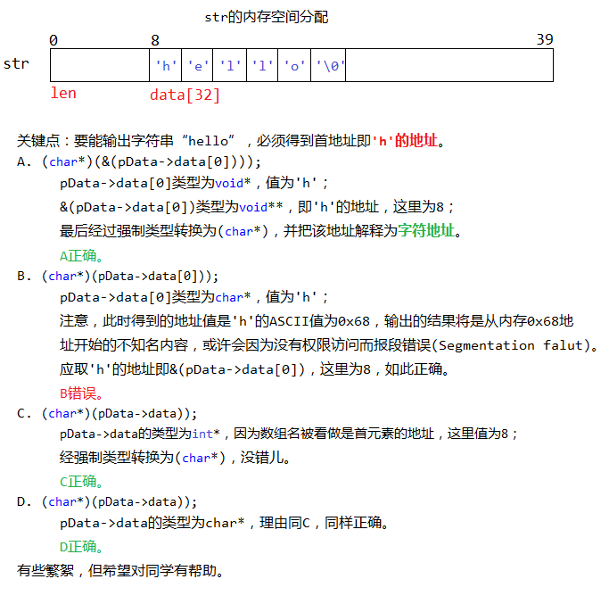
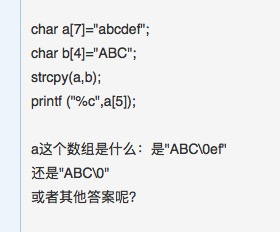

- 内存管理策略
- 静态局部变量只对定义它的函数体始终可见，函数体执行完过后虽然还存在，但是无法被其他的使用
```c++
static int a=1;
void fun1(void){    a=2;  }
void fun2(void){    int a=3;  }
void fun3(void){   static int a=4;  }
int main(int argc,char** args){ 
     printf(“%d”,a); 
     fun1( ); 
     printf(“%d”,a); 
     fun2( ); 
     printf(“%d”，a);
     fun3( );
      printf(“%d”,a); 
}
```
- 函数传参形式
- const 类型的对象能否修改
- fork 产生的进程数（有无缓冲）

-	case 后面的常量表达式实际上只起语句标号作用 , 而不起条件判断作用 , 即 " 只是开始执行处的入口标号 ".  因此 , 一旦与 switch 后面圆括号中表达式的值匹配 , 就从此标号处开始执行 , 而且执行完一个 case 后面的语句后 , 若没遇到 break 语句 , 就自动进入 下一个 case 继续执行 , 而不在判断是否与之匹配 , 直到遇到 break 语句才停止执行 , 退出 break 语句 . 因此 , 若想执行一个 case 分之后立即跳出  switch 语句 , 就必须在此分支的最后添加一个 break 语句


- - 数二进制中 1 的位数
- 宏的展开
```c++
structA{
   unsigned int a; //对于开始连续的第一个8字节内存，a占4字节 
   char b[2];      //b[]占1*2字节，在a后的连续2字节内存放，还剩2个字节，
   double c;       //c占8字节，第一个8字节还剩2字节不足以存放c,自动补充该2字节。并同时开辟第二个8字节内存存放c
   short d;        //d占2字节，开辟第三个8字节，存放d。剩余的6个字节补齐。故总共开辟了8*3=24字节存放该数据结构
}
```
- 前缀 ++ 和后缀 ++
- 指针，传地址，对形参的操作就是对实参的操作；
- 引用，形参作为实参的别名，实质也是对实参的操作；
- 传值，若没有返回操作，对形参的操作不会引起实参的变化。


-	有关动态分配和静态分配：
所谓动态内存分配就是指在程序执行的过程中动态地分配或者回收存储空间的分配内存的方法。动态内存分配不象数组等静态内存分配方法那样需要预先分配存储空间，而是由系统根据程序的需要即时分配，且分配的大小就是程序要求的大小。例如我们定义一个float型数组：float score[100]; 但是，在使用数组的时候，总有一个问题困扰着我们：数组应该有多大？在很多的情况下，你并不能确定要使用多大的数组，比如上例，你可能并不知道我们要定义的这个数组到底有多大，那么你就要把数组定义得足够大。这样，你的程序在运行时就申请了固定大小的你认为足够大的内存空间。即使你知道你想利用的空间大小，但是如果因为某种特殊原因空间利用的大小有增加或者减少，你又必须重新去修改程序，扩大数组的存储范围。这种分配固定大小的内存分配方法称之为静态内存分配。但是这种内存分配的方法存在比较严重的缺陷，特别是处理某些问题时：在大多数情况下会浪费大量的内存空间，在少数情况下，当你定义的数组不够大时，可能引起下标越界错误，甚至导致严重后果。
-	我们用动态内存分配就可以解决上面的问题. 所谓动态内存分配就是指在程序执行的过程中动态地分配或者回收存储空间的分配内存的方法。动态内存分配不象数组等静态内存分配方法那样需要预先分配存储空间，而是由系统根据程序的需要即时分配，且分配的大小就是程序要求的大小。从以上动、静态内存分配比较可以知道动态内存分配相对于静态内存分配的特点：
- 不需要预先分配存储空间；

- 分配的空间可以根据程序的需要扩大或缩小。

- 说白了，内存的静态分配和动态分配的区别主要是两个：
	- 一是时间不同。静态分配发生在程序编译和连接的时候。动态分配则发生在程序调入和执行的时候。
	- 二是空间不同。堆都是动态分配的，没有静态分配的堆。栈有2种分配方式：静态分配和动态分配。静态分配是编译器完成的，比如局部变量的分配。动态分配由函数alloca（）进行分配。不过栈的动态分配和堆不同，他的动态分配是由编译器进行释放，无需我们手工实现。    

- 对于一个进程的内存空间而言，可以在逻辑上分成3个部份：代码区，静态数据区和动态数据区。动态数据区一般就是“堆栈”。“栈(stack)”和“堆(heap)”是两种不同的动态数据区，栈是一种线性结构，堆是一种链式结构。进程的每个线程都有私有的“栈”，所以每个线程虽然代码一样，但本地变量的数据都是互不干扰。一个堆栈可以通过“基地址”和“栈顶”地址来描述。全局变量和静态变量分配在静态数据区，本地变量分配在动态数据区，即堆栈中。程序通过堆栈的基地址和偏移量来访问本地变量。

- 一般，用static修饰的变量，全局变量位于静态数据区。函数调用过程中的参数，返回地址，EBP和局部变量都采用栈的方式存放

- strcpy执行时，会自动在字符串后面添加上"\0"

```c++
i = ++a || ++b || ++c;
```

- 右边的表达式为关系表达式，判断为1或0，先执行++a，a=2，因此为true，或操作的前部分为true时，后面不再执行，因此第一个和第二个“或”操作后面都不再执行。因此i  = 1, a = 2. b和c不变。


题记


----------

 - 维数较大的二维数组，对其读写按行操作cache效率更高
 - 字符串赋值
	 - strcpy
	 - char array[] = {'A', 'B', 'C', 'D', 'E', 'F', 'G'};
	 - char array[] = "ABCDEFG";
 - 按照补码对数字进行二进制存储
	 - -25 对应二进制数 10011001
	 - 反码 11100110
	 - 补码11100111 E7H
```c++
static int a=1;
void fun1(void)
{    
	a=2;  
}
void fun2(void)
{    
	int a=3;  
}
void fun3(void)
{
	static int a=4;
}
int main(int argc,char** args)
{ 
     printf(“%d”,a); 
     fun1( ); 
     printf(“%d”,a); 
     fun2( ); 
     printf(“%d”，a);
     fun3( );
     printf(“%d”,a); 
}
```
上述代码执行结果：1 2 2 4
 - 引用传值和指针传值
```c++
const int i = 0; 
int *j = (int *) &i; 
*j = 1; 
printf("%d,%d", i, *j)
```
const 类型的对象不能被修改、const 类型的对象定义是必须被初始化、引用类型的实体定义时必须被初始化

- fork() 之后会产生多少个进程和 fork() 之后总共产生多少个进程
```c++
int Function(unsigned int n) {
     
        n = (n & 0x55555555) + ((n >> 1) & 0x55555555);
        n = (n & 0x33333333) + ((n >> 2) & 0x33333333);
        n = (n & 0x0f0f0f0f) + ((n >> 4) & 0x0f0f0f0f);
        n = (n & 0x00ff00ff) + ((n >> 8) & 0x00ff00ff);
        n = (n & 0x0000ffff) + ((n >> 16) & 0x0000ffff);
 
        return n;
}
```
上述代码计算二进制数中 1 的个数

- C++语言中 inline 函数只是建议编译器将函数体直接插入到调用此函数的地方，以加快程序运行速度
- 局部变量和全局变量可以重名，作用域不同生命周期不同，不发生冲突
- 静态局部变量内存是编译时分配的
- C++不是安全性语言，线程安全
- 字符串数组和字符数组
- uint16_t、uint32_t、uint64_t
- 函数调用与传参
- 无论哪个平台下不论 32 位还是 64 位操作系统可使用内存是由限制的
- 栈和堆的分配内存规则，调用 new 和 malloc 动态分配堆上面的空间，而调用 alloc 动态分配栈上的内存空间，对不能静态分配内存
```c++
int main(void){
  int i;
  for(i=0;i<4;i++){
  fork();
  printf("-\n");
 }
 return 0;
}
```
- 操作系统有多少个 “-” 被打印
- 代码编译阶段将会生成汇编语言
- 代码生成阶段把中间代码转换成具有依赖具体机器的目标代码
- strcpy 函数拷贝原理

#### 错误笔记

- 静态局部变量仍然是局部变量，出了函数体就被释放


----------

```c++
#include<stdio.h>
struct str_t{
   long long len;
   char data[32];
};
struct data1_t{
   long long len;
   int data[2];
};
struct data2_t{
   long long len;
   char *data[1];
};
struct data3_t{
   long long len;
   void *data[];
};
int main(void)
{
   struct str_t str;
   memset((void*)&str,0,sizeof(struct str_t));
   str.len=sizeof(struct str_t)-sizeof(int);
   snprintf(str.data,str.len,"hello");//VS下为_snprintf
   ____________________________________;
   ____________________________________;
   return 0;
}
#include<stdio.h>
struct str_t{
   long long len;
   char data[32];
};
struct data1_t{
   long long len;
   int data[2];
};
struct data2_t{
   long long len;
   char *data[1];
};
struct data3_t{
   long long len;
   void *data[];
};
int main(void)
{
   struct str_t str;
   memset((void*)&str,0,sizeof(struct str_t));
   str.len=sizeof(struct str_t)-sizeof(int);
   snprintf(str.data,str.len,"hello");//VS下为_snprintf
   ____________________________________;
   ____________________________________;
   return 0;
}
```
- 正确输出 hello 必须得到 hello 的首地址

<div align="center">  </div><br>

- 在一个64位的操作系统中定义如下结构体：

```c++
struct st_task
{
    uint16_t id;
    uint32_t value;
    uint64_t timestamp;
};
void fool()
{
    st_task task = {};
    uint64_t a = 0x00010001;
    memcpy(&task, &a, sizeof(uint64_t));
    printf("%11u,%11u,%11u", task.id, task.value, task.timestamp);
}
```
<div align="center">  </div><br>

- strcpy 的实现及原理
```c++
char* strcpy()
{
	if((dst == NULL) || (src == NULL))
		return NULL; 
    char *ret = dst; //[1]
    while ((*dst++ = *src++) != '\0'); //[2] 
    return ret;//[3]
}
```

- const 修饰：源字符串参数用const修饰，防止修改源字符串；
- 空指针检查：源指针和目的指针都有可能会出现空指针的情况，所以应该对其进行检查；
- 为什么要设置ret 指针以及返回ret指针的位置[3]，由于目的指针dst已经在进行移动了，所以用辅助指针ret表明首指针；
- 以上所示[2]处，为简单的字符串的复制过程，正好表明strcpy函数遇到'\0'将会停止；

<div align="center">  </div><br>

- strcpy 不仅复制字符串内容并且复制字符串的结尾标识符 "\0";